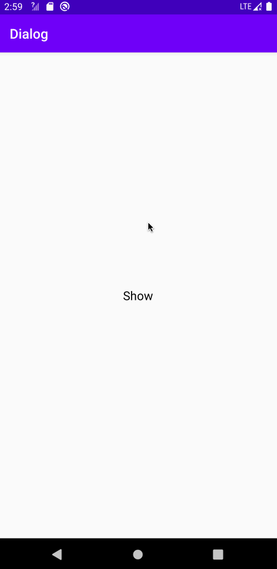
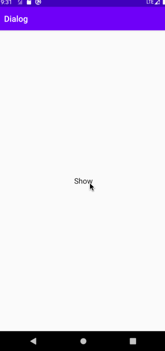
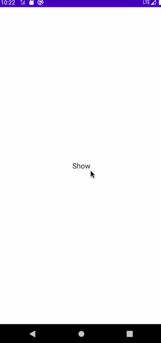
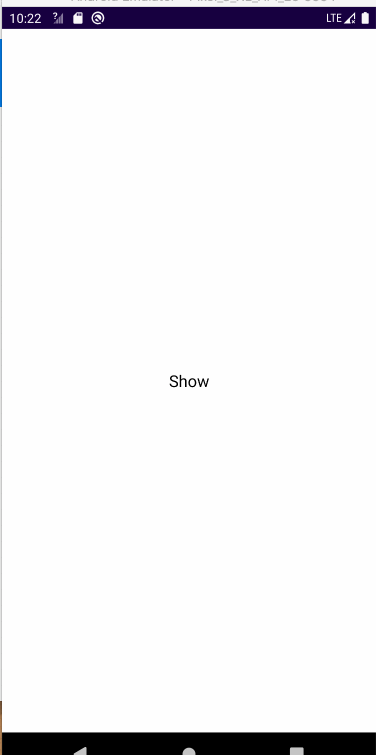

## Androidx 简单好用的Dialog封装库

#### 1、依赖

```kotlin
    implementation 'com.xhh.dialog:dialog:1.0.0'
```

#### 2、使用

##### 2.1、样式介绍

* DEFAULT - 默认弹窗
* BOTTOM_SHEET - 底部弹窗
* FULL_SCREEN - 全屏弹窗

##### 2.2、示例

* 默认弹窗

```kotlin
AndroidDialog.builder(R.layout.dialog_confirm){
                setCornerRadius {
                    floatArrayOf(24f,24f,24f,24f,24f,24f,24f,24f)
                }
            }.alert(supportFragmentManager,"")
```



* 底部弹窗

```kotlin
AndroidDialog.builder(R.layout.dialog_bottom,
                      AndroidDialog.BOTTOM_SHEET){
                setCornerRadius {
                    floatArrayOf(24f,24f,24f,24f,0f,0f,0f,0f)
                }
                
            }.alert(supportFragmentManager,"")
```



* 全屏弹窗

```kotlin
 AndroidDialog.builder(R.layout.dialog_full_screen,
 												AndroidDialog.FULL_SCREEN){
            }.alert(supportFragmentManager,"")
```



#### 3、参数说明

| 参数       | 说明                                                         |
| ---------- | ------------------------------------------------------------ |
| layoutId   | Dialog的布局文件Id                                           |
| dialogType | Dialog的类型：DEFAULT默认弹窗、BOTTOM_SHEET底部弹窗、FULL_SCREEN全屏弹窗 |

示例：

```kotlin
AndroidDialog.builder(
                R.layout.dialog_full_screen,
                AndroidDialog.FULL_SCREEN
            ){
            
            }.alert(supportFragmentManager, "")//调用alert()显示弹窗
```

| 方法                               | 说明                               |
| ---------------------------------- | ---------------------------------- |
| setSize(width,height)              | 设置Dialog的宽、高                 |
| setCanceledOnTouchOutside(boolean) | 设置Dialog是否可以点击外部区域取消 |
| setDimAmount()                     | 设置背景灰度                       |
| setAnim()                          | 设置Dialog的进出场动画             |
| setCornerRadius()                  | 设置Dialog的圆角                   |
| onDismiss()                        | Dialog取消的回调                   |

示例：

```kotlin
private lateinit var dialog:AndroidDialog

AndroidDialog.builder(R.layout.dialog_confirm){
                setAnim { 
                    R.style.DialogAnim
                }
                setCanceledOnTouchOutside(false)
                setDimAmount { 
                    1f
                }
                setSize(300,400)
                setCornerRadius {
                    floatArrayOf(24f,24f,24f,24f,24f,24f,24f,24f)
                }
            }
						//show dialog
						dialog.alert(supportFragmentManager,"")
						//dismiss dialog
            dialog.hide()
```

* 逻辑处理

  > 通过onHandle方法进行Dialog的逻辑处理

```kotlin
 AndroidDialog.builder(
                R.layout.dialog_full_screen,
                AndroidDialog.FULL_SCREEN
            ) {

            }.onHandle {view->

                Log.e("=onHandle=", "==111==")

            }.alert(supportFragmentManager, "")
```

* 拦截物理返回键

  > 调用observeOnBackPressed方法可以拦截Dialog的物理返回键。true拦截，false不拦截

```kotlin
val dialog = AndroidDialog.builder(
                R.layout.dialog_full_screen,
                AndroidDialog.FULL_SCREEN
            ) {
                setCanceledOnTouchOutside(false)

                // setSize(-1,300)
            }.observeOnBackPressed {
                Toast.makeText(this,
                               "拦截物理返回键",
                               Toast.LENGTH_LONG)
  														.show()
                true
            }
            dialog.alert(supportFragmentManager, "")
```

